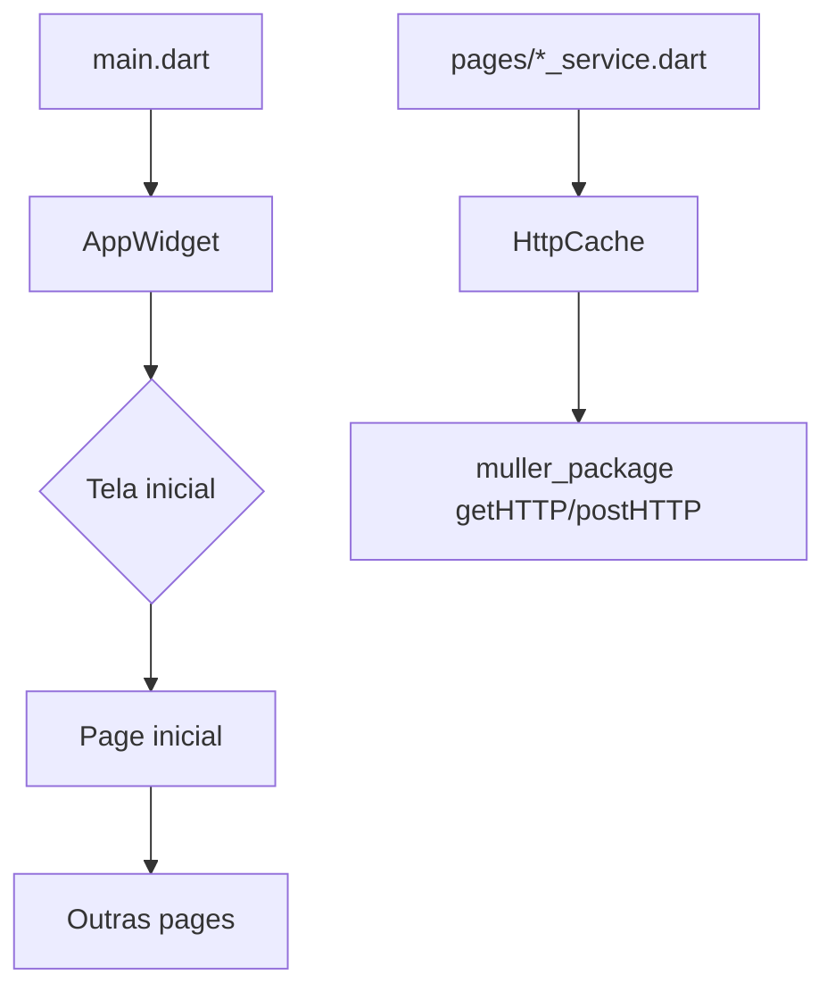

# Padrão de estrutura — Flutter + `muller_package`

Documento de **padrão de desenvolvimento** para qualquer app Flutter que use o kit compartilhado **`muller_package`**.

A regra é a mesma em todo projeto: o pacote é genérico e reutilizável; o app guarda só o que é **específico do produto** (telas, BLoC, models da API, identidade visual).

Copiar este arquivo para `docs/ESTRUTURA.md` de um app novo e seguir as seções abaixo. Não inventar outra organização de pastas.

---

## 1. Visão geral

| Camada | Onde vive | O que entra aqui |
|--------|-----------|------------------|
| Kit compartilhado | `muller_package` | Scaffold, formulários, HTTP, snackbar, tokens (spacing, radius, strings) |
| Bootstrap do app | `lib/app_config/` | `MaterialApp`, tema, conectividade, cores e endpoints **deste** produto |
| Features | `lib/pages/` | Uma pasta por tela/fluxo, com BLoC quando houver API |
| Widgets de domínio | `lib/widgets/` | Componentes deste produto reutilizados por várias páginas |
| Utilitários | `lib/functions/` | Storage, cache HTTP, GPS, permissões — sem UI |
| DTOs da API | `lib/models/` | `fromJson` / `toJson` alinhados ao backend **deste** produto |



---

## 2. Como as pastas são separadas

A organização do app **espelha** a do `muller_package`, com duas pastas a mais (`pages/` e `app_config/`) porque o pacote não tem telas nem bootstrap de aplicativo.

| Pasta no app | Papel | Equivalente no `muller_package` |
|--------------|-------|--------------------------------|
| `lib/app_config/` + `const/` | Bootstrap, tema, conectividade, cores e endpoints do produto | `lib/app_consts/` |
| `lib/widgets/` | Widgets de domínio deste app | `lib/app_components/` |
| `lib/functions/` | Utilitários sem UI (JWT, cache, GPS, permissões) | `lib/functions/` |
| `lib/models/` | DTOs da API deste produto | `lib/models/` (no pacote: `ErrorModel`) |
| `lib/pages/` | Features com BLoC | não existe no pacote |
| HTTP | `lib/functions/http_cache.dart` envolve o cliente do pacote | `lib/request_http/` |

### O que vai em cada pasta (decisão rápida)

- **Nova tela com API** → pasta em `lib/pages/<feature>/` com os 5 arquivos BLoC.
- **Tela só de UI, sem API** → um `*_page.dart` na pasta da feature (FAQ, mapa local, onboarding estático).
- **Widget / função / validator / máscara genéricos que se repetem em várias telas** → criar no **`muller_package`** (não duplicar no app).
- **Widget de domínio deste produto** usado em mais de uma página → `lib/widgets/`.
- **Widget usado só em uma tela** → fica na pasta da feature (ex.: `filters/`).
- **Função sem widget, específica deste produto** (JWT, cache, GPS) → `lib/functions/`.
- **Constante de produto** (cor, endpoint, animação) → `lib/app_config/const/`.
- **Constante/componente genérico** → não copiar para o app; usar o `muller_package`.
- **DTO da API** → `lib/models/`. Não colocar model de tela no BLoC; o state referencia o model.

---

## 3. Árvore padrão de `lib/`

Pastas e arquivos **obrigatórios** em todo app. Features em `pages/` mudam por produto.

```
lib/
├── main.dart                          # entrada: binding + runApp(AppWidget)
├── app_config/
│   ├── app_widget.dart                # MaterialApp, tema, navigatorKey, tela inicial
│   ├── connectivity_controller.dart   # opcional: status de rede
│   ├── theme_controller.dart          # opcional: claro/escuro
│   └── const/
│       ├── app_colors.dart            # paleta deste produto
│       ├── app_endpoints.dart         # única fonte de URLs
│       └── app_animations.dart        # opcional: paths Lottie
├── functions/                         # utilitários sem UI
│   ├── http_cache.dart                # JWT + cache 5 min nas listagens
│   ├── local_storage.dart             # sessão / preferências
│   ├── token_storage.dart             # token seguro (se houver auth)
│   └── validators.dart                # só o que o pacote ainda não cobre
├── models/                            # um arquivo por recurso da API
│   └── <recurso>_model.dart
├── widgets/                           # reuso de domínio deste app
│   ├── app_elevated_button.dart       # wrapper do botão do pacote com cores do produto
│   ├── app_loading.dart               # loading padrão deste app
│   └── ...
└── pages/
    └── <feature>/                     # snake_case
        ├── <feature>_page.dart
        ├── <feature>_bloc.dart
        ├── <feature>_event.dart
        ├── <feature>_state.dart
        └── <feature>_service.dart
```

Shell de abas (se o app tiver menu inferior): `lib/pages/menu/menu.dart` + uma subpasta por aba.

Código nativo (`android/`, `ios/`, `web/`, …), `pubspec.yaml`, `assets/` e CI **não** recebem feature Dart. Feature nova = só `lib/`.

---

## 4. Padrão BLoC (obrigatório em feature com API)

Toda feature que fala com a API usa **uma pasta** e **cinco arquivos** com o mesmo prefixo:

```
lib/pages/<feature>/
├── <feature>_page.dart      # UI
├── <feature>_bloc.dart      # orquestra
├── <feature>_event.dart     # intenções do usuário
├── <feature>_state.dart     # estados da tela
└── <feature>_service.dart   # HTTP puro
```

| Arquivo | Responsabilidade | Pode / não pode |
|---------|------------------|-----------------|
| `*_page.dart` | `StatefulWidget`, formulários, `BlocBuilder` / `BlocConsumer`. Dispara eventos. | **Não** chama HTTP. **Não** contém regra de API. |
| `*_bloc.dart` | `Bloc<Event, State>`. Chama o service, emite estados, snackbar e navegação. | **Não** monta widgets. **Não** define URL. |
| `*_event.dart` | Classes de evento (`Load`, `Save`, `Cancel`…). | Só dados do que aconteceu na UI. |
| `*_state.dart` | `Initial` / `Loading` / `Success` / `Error` com `ErrorModel` do pacote. | Estado compartilhado na classe base. |
| `*_service.dart` | Funções `Future` com `HttpCache` + `AppEndpoints`. Parse mínimo para `AppResponse`. | **Não** emite BLoC. **Não** mostra snackbar. |

Telas de edição que compartilham o mesmo recurso reutilizam o `*_service.dart` do fluxo pai — não duplicar HTTP.

### Cache HTTP (5 minutos em toda listagem)

Toda rota de **listagem** (GET que devolve coleção: lista, grade, busca, home, promoções) passa por `HttpCache.getHTTPCached`. Duração padrão: **5 minutos**.

| Tipo de chamada | Cache | Como chamar |
|-----------------|-------|-------------|
| GET de listagem | **Sim, 5 min** | `HttpCache.getHTTPCached` |
| GET de detalhe (1 item) | Sim, 5 min (mesmo helper) | `HttpCache.getHTTPCached` |
| Pull-to-refresh / “atualizar agora” | Ignora cache desta vez | `forceRefresh: true` |
| POST / PUT / DELETE | **Nunca** | `HttpCache.postHTTPCached` / `putHTTPCached` (sempre rede) |
| Login / cadastro | **Nunca** | `getHTTP` / `postHTTP` do pacote, sem `HttpCache` |

Regras:

- Não chamar `getHTTP` direto na service de listagem.
- Depois de um save/update/delete que altera aquela lista, **invalidar** o cache do endpoint (`HttpCache.invalidateContaining`) ou o próximo load usar `forceRefresh: true`.
- A duração (5 min) vive em `HttpCache` — não espalhar outro TTL por feature.

```dart
Future<AppResponse> getUsuarios({bool forceRefresh = false}) async {
  return HttpCache.getHTTPCached(
    endpoint: AppEndpoints.endpointUsuarios,
    forceRefresh: forceRefresh,
  );
}
```

### Contrato de state

```dart
abstract class ExemploState {
  ErrorModel errorModel;
  ExemploState({required this.errorModel});
}

class ExemploInitialState extends ExemploState {
  ExemploInitialState() : super(errorModel: ErrorModel.empty());
}

class ExemploLoadingState extends ExemploState {
  ExemploLoadingState() : super(errorModel: ErrorModel.empty());
}

class ExemploSuccessState extends ExemploState { /* dados */ }

class ExemploErrorState extends ExemploState {
  ExemploErrorState({required super.errorModel});
}
```

### Contrato de bloc

1. `emit(ExemploLoadingState())`
2. `try` → chamar service → `emit(ExemploSuccessState(...))` → snackbar / `open()`
3. `catch` → `emit(ExemploErrorState(errorModel: ApiException.errorModel(e)))` → `showSnackbarError`

### Quando **não** criar BLoC

- Tela estática (FAQ, termos, help).
- Shell de tabs (só troca índice).
- Popup/filtro local que devolve um objeto para o BLoC da lista.
- Detalhe que **reusa** o BLoC da lista já existente.

Não criar service se não houver HTTP.

---

## 5. Regras das pages (`*_page.dart`)

Toda `*_page.dart` segue a **mesma ordem de membros** no State. Não misturar blocos.

### 5.1 Ordem obrigatória no arquivo

```
1. imports
2. class Page (StatefulWidget ou StatelessWidget)
3. bloc
4. variáveis / instâncias de classes
5. funções (navegar, disparar bloc, atualizar tela, validar, etc.)
6. initState
7. widgets (um método por parte da tela)
8. body (reúne todas as partes)
9. build
10. dispose
```

Esqueleto:

```dart
import 'package:flutter/material.dart';
import 'package:flutter_bloc/flutter_bloc.dart';
import 'package:muller_package/muller_package.dart';
// imports do app...

class ExemploPage extends StatefulWidget {
  const ExemploPage({super.key});

  @override
  State<ExemploPage> createState() => _ExemploPageState();
}

class _ExemploPageState extends State<ExemploPage> {
  // 3. bloc
  ExemploBloc bloc = ExemploBloc();

  // 4. variáveis / instâncias
  final _formKey = GlobalKey<FormState>();
  late AppFormField campoNome;

  // 5. funções (abrir tela, chamar bloc, setState, validar...)
  void _saveUsuario() {
    if (_formKey.currentState?.validate() ?? false) {
      bloc.add(ExemploSaveEvent(campoNome.controller.text));
    }
  }

  void _openTelaCadastro() {
    open(screen: const CadastroPage());
  }

  Future<void> _loadUsuarios() async {
    bloc.add(ExemploLoadEvent());
  }

  // 6. initState
  @override
  void initState() {
    super.initState();
    campoNome = AppFormField(context: context, hint: AppStrings.exemplo);
    _loadUsuarios();
  }

  // 7. widgets — um método por parte da tela
  Widget _headerTitulo() { /* ... */ }

  Widget _formCampos() { /* ... */ }

  Widget _actionsBotoes() { /* ... */ }

  // 8. body — só junta as partes
  Widget _bodyTela() {
    return AppScrollVertical(
      child: Column(
        children: [
          _headerTitulo(),
          _formCampos(),
          _actionsBotoes(),
        ],
      ),
    );
  }

  // 9. build — só shell (scaffold + BlocBuilder + body)
  @override
  Widget build(BuildContext context) {
    return scaffold(
      title: AppStrings.exemplo,
      body: BlocBuilder<ExemploBloc, ExemploState>(
        bloc: bloc,
        builder: (context, state) {
          if (state is ExemploLoadingState) return appLoading();
          if (state is ExemploErrorState) {
            return appError(state.errorModel, function: _saveUsuario);
          }
          return _bodyTela();
        },
      ),
    );
  }

  // 10. dispose
  @override
  void dispose() {
    bloc.close();
    super.dispose();
  }
}
```

`build` **não** monta a tela. Ele só escolhe loading / erro / `_bodyTela()`. `_bodyTela()` **não** contém layout solto: só chama os métodos de widget.

Se o app tiver um loading próprio (wrapper do pacote com a cor do produto), usar esse wrapper no lugar de `appLoading()`.

### 5.2 Como quebrar em métodos de widget

- Sempre criar **vários métodos** (`_headerTitulo`, `_formCampos`, `_listaItens`, `_actionsBotoes`…). Não deixar a tela inteira em um único método.
- Um método de widget **não** pode ser só um widget isolado (ex.: um método que retorna apenas um `appSizedBox`). O método representa uma **parte** da tela.
- **Regra dos 3 itens:** se um `Column`, `Row`, `ListView` ou bloco tiver **mais de 3 filhos / itens**, extrair um grupo para um **novo método**.

```dart
// ERRADO — tudo no body
Widget _bodyTela() {
  return Column(
    children: [
      logo, titulo, campo1, campo2, campo3, botao, link, rodape,
    ],
  );
}

// ERRADO — método com 1 widget só
Widget _espacoPadding() => appSizedBox(height: AppSpacing.normal);

// CERTO — partes com responsabilidade
Widget _headerTitulo() => Column(children: [logo, titulo, subtitulo]); // 3 itens: ok
Widget _formCampos() => Column(children: [campo1, campo2]);            // 2 itens: ok
Widget _actionsBotoes() => Column(children: [botao, link]);
Widget _bodyTela() => Column(children: [_headerTitulo(), _formCampos(), _actionsBotoes()]);
```

Se `_headerTitulo()` crescer para 4+ itens, quebrar de novo (`_headerLogo()`, `_headerMeta()`, etc.).

### 5.3 Tipo de retorno, `_` e nomes EN + PT

Vale para **todo** método/função da page e o mesmo padrão nas outras camadas (`bloc` interno, helpers na page).

**Tipo de retorno sempre explícito** — nunca omitir à esquerda do nome:

```dart
void _saveUsuario() { ... }
Widget _listaItens() { ... }
Future<void> _loadUsuarios() async { ... }
String? _validateEmail(String? value) { ... }
bool _hasSessao() { ... }
```

Errado: `_loadUsuarios() async { ... }` (sem `Future<void>`), `_header() { ... }` (sem `Widget`).

**Privado = prefixo `_`.** Métodos e funções usados só na classe levam `_`. Overrides públicos do Flutter (`initState`, `build`, `dispose`) **não** levam `_`.

**Nome = verbo em inglês + substantivo em português** (camelCase):

| Papel | Exemplo |
|-------|---------|
| Carregar dados | `_loadUsuarios`, `_loadProdutos` |
| Salvar | `_saveUsuario`, `_savePedido` |
| Abrir tela | `_openTelaCadastro`, `_openDetalheItem` |
| Atualizar UI | `_refreshLista`, `_updateFiltros` |
| Widget de parte | `_headerTitulo`, `_formCampos`, `_listaItens`, `_actionsBotoes`, `_bodyTela` |

```dart
// ERRADO
save() {}
void load() {}
void _carregar() {}
void _usuarios() {}
Widget header() { ... }

// CERTO
void _saveUsuario() { ... }
Future<void> _loadUsuarios() async { ... }
void _openTelaCadastro() { ... }
Widget _headerTitulo() { ... }
```

### 5.4 Reuso: `muller_package` primeiro

Usar **o máximo possível** do `muller_package` na page: `scaffold`, `AppFormField`, `AppFormFormatters`, `appText`, `appContainer`, `appSizedBox`, `appInfoColumn`, `AppScrollVertical`, `open()`, `appError`, `appLoading`, `AppStrings`, `AppSpacing`, `AppRadius`, `AppIcons`, validators e máscaras do pacote.

**Se um componente, função, validator, form field ou máscara se repetir em várias telas**, não copiar no app. **Criar no `muller_package`:**

| Tipo | Pasta no pacote | Exportar em |
|------|-----------------|-------------|
| Widget / form field | `lib/app_components/` (ou `form_field/`) | `muller_package.dart` |
| Validator / máscara / formatter | `lib/app_consts/` ou `lib/functions/` | `muller_package.dart` |
| Função genérica (navegação, parse, format) | `lib/functions/` | `muller_package.dart` |

Só fica no app o que é **específico deste produto**: paleta, endpoints, JWT/cache, cards de domínio.

Fluxo de decisão:

1. Já existe no `muller_package`? → usar.
2. Vai se repetir em várias telas e é genérico? → criar no pacote, exportar no barrel, usar no app.
3. É domínio deste produto e se repete? → `lib/widgets/` ou `lib/functions/`.
4. É só desta tela? → método privado na page (ou subpasta da feature).

---

## 6. Navegação e bootstrap

Não usar rotas nomeadas (`routes:` / `GoRouter`) neste padrão.

1. `MaterialApp(home:)` definido em `AppWidget` (método que resolve a primeira tela).
2. Troca de tela com `open(screen: ..., closePrevious: ...)` do `muller_package`.
3. Abas de menu (se existirem): índice estático no shell, sem rota.
4. Fluxo “filho” que precisa voltar e recarregar: `Navigator.push` + `pop`.

`AppContext.navigatorKey` do pacote **deve** estar no `MaterialApp` — snackbars e `open()` dependem disso.

Pós-login (se o app tiver auth): uma função em `functions/` (ex.: `_openHomeAfterAuth` / `openHomeAfterAuth`) — a page não decide a pilha na mão.

Em HTTP **401**, `HttpCache` limpa sessão e faz `open` para a tela de login com `closePrevious: true`.

---

## 7. Relação com o `muller_package`

Dependência no `pubspec.yaml` do app. Import padrão:

```dart
import 'package:muller_package/muller_package.dart';
```

A page deve preferir sempre o pacote. Componente, função, validator, form field ou máscara **genéricos que se repetem** entram no `muller_package` (e no barrel). O app só customiza identidade do produto (cores, JWT, cards de domínio). Ver [seção 5.4](#54-reuso-muller_package-primeiro).

### O que usar do pacote (não reimplementar no app)

| Categoria | Símbolos |
|-----------|----------|
| Layout | `scaffold`, `AppScrollVertical`, `appScrollHorizontal`, `appContainer`, `appSizedBox`, `appInfoColumn` |
| Formulários | `AppFormField`, `AppFormFormatters` |
| HTTP | `getHTTP`, `postHTTP`, `putHTTP`, `AppResponse`, `ApiException`, `ErrorModel` |
| Navegação | `open`, `AppContext`, `AppContext.navigatorKey` |
| Feedback | `showSnackbarSuccess` / `Error` / `Warning`, `appError`, `appLoading` |
| Tokens | `AppSpacing`, `AppRadius`, `AppFontSizes`, `AppStrings`, `AppIcons` |
| Extra | `appText`, `showModalEmpty`, `appAnimation`, `formataDinheiro`, `validaEmail` |

### O que o app customiza localmente (identidade do produto)

| No app | Motivo |
|--------|--------|
| `app_config/const/app_colors.dart` | Paleta deste produto. Alias `as local` se conflitar com `AppColors` do pacote. |
| `app_config/const/app_endpoints.dart` | URLs deste backend. |
| `widgets/app_elevated_button.dart` | Wrapper do botão do pacote com a cor do produto. |
| `widgets/app_loading.dart` | Loading com a identidade do produto (se `appLoading` do pacote não bastar). |
| `functions/http_cache.dart` | JWT + cache de **5 min** em GET de listagem; POST/PUT sem cache. |
| `functions/validators.dart` | Só validators que o pacote ainda não tem. |

Item novo no pacote que ainda **não** está no barrel: importar o subpath **ou** (preferível) exportar no `muller_package.dart`.

### Estrutura do `muller_package`

```
muller_package/lib/
├── muller_package.dart          # barrel — único import público
├── app_components/              # widgets genéricos
├── app_consts/                  # tokens e AppContext
├── functions/                   # formatters, navigation, validators, image
├── models/error_model.dart
└── request_http/                # api_connection, api_service, api_exception
```

**HTTP no pacote:** `hasInternetConnection()` → `getHTTP` / `postHTTP` / `putHTTP` → status ≠ 200 vira `ApiException` → `ApiException.errorModel(e)` vira `ErrorModel` no BLoC.

No app, **não chamar `getHTTP` direto nas páginas**. Services de listagem usam `HttpCache.getHTTPCached` (TTL 5 min). Login/cadastro chamam o pacote **sem** cache.

---

## 8. Papel de cada tipo de arquivo no app

Não é inventário de um produto. É o **contrato** de cada tipo de arquivo.

| Arquivo | Responsabilidade |
|---------|------------------|
| `main.dart` | Binding + `runApp(AppWidget)`. Sem regra de negócio. |
| `app_widget.dart` | `MaterialApp`, tema, `navigatorKey`, resolve a primeira page. |
| `theme_controller.dart` | Claro/escuro persistido (se o app tiver). |
| `connectivity_controller.dart` | Status de rede para overlay (se o app tiver). |
| `const/app_colors.dart` | Paleta do produto. |
| `const/app_endpoints.dart` | Única fonte de URLs. |
| `http_cache.dart` | JWT, 401 e cache de **5 min** em toda rota de listagem. |
| `local_storage.dart` / `token_storage.dart` | Sessão. |
| `*_model.dart` | DTO. Sem widget, sem BLoC. Pode importar outro model. |
| `lib/widgets/*` | Reuso de domínio deste app. |
| `*_page.dart` | UI. Segue a [seção 5](#5-regras-das-pages-_page-dart). |
| `*_bloc.dart` | Event → service → state + snackbar/`open()`. |
| `*_event.dart` | Intenção da UI. |
| `*_state.dart` | Initial / Loading / Success / Error. |
| `*_service.dart` | HTTP puro. |

---

## 9. Fluxo de dados

```
UI (*_page.dart)
  → dispara Event
    → Bloc trata Event
      → chama Service
        → HttpCache (GET listagem: cache 5 min; POST/PUT: sempre rede)
          → muller_package getHTTP/postHTTP/putHTTP
            → API (AppEndpoints)
      ← AppResponse / ApiException
    ← emite State + snackbar
  ← BlocBuilder reconstrói
```

---

## 10. Checklist — nova feature

1. Pasta `lib/pages/<nome>/` em snake_case.
2. Cinco arquivos com o **mesmo prefixo**: `*_page`, `*_bloc`, `*_event`, `*_state`, `*_service` (omitir bloc/service se não houver API).
3. State: `Initial` / `Loading` / `Success` / `Error` com `ErrorModel`.
4. Service: só HTTP via `HttpCache` + URL em `AppEndpoints`. Toda **listagem** (GET) usa `getHTTPCached` com cache de **5 min**; mutações sem cache; login/cadastro sem `HttpCache`.
5. Page: ordem da [seção 5](#5-regras-das-pages-_page-dart) (imports → bloc → variáveis → funções → initState → widgets → body → build → dispose).
6. Vários métodos de widget; mais de 3 itens no bloco → extrair método. `build` só chama `_bodyTela()`.
7. Tipo de retorno explícito; privado com `_`; nome verbo EN + substantivo PT (`_loadUsuarios`).
8. UI com `scaffold`, `AppFormField`, tokens e validators do `muller_package`.
9. Bloc: snackbars do pacote; navegação com `open()`.
10. Recurso novo da API → `lib/models/<recurso>_model.dart`.
11. Genérico que se repete → `muller_package` + barrel. Domínio do produto que se repete → `lib/widgets/` ou `lib/functions/`. Só desta tela → método privado ou subpasta.
12. Não duplicar o que já existe no pacote. Não criar rotas nomeadas.

---

## 11. Nomenclatura

| Tipo | Convenção | Exemplo |
|------|-----------|---------|
| Pasta de feature | snake_case | `user_profile/` |
| Arquivos da feature | `<pasta>_<camada>.dart` | `login_bloc.dart` |
| Classe Page | PascalCase + `Page` | `LoginPage` |
| Classe Bloc | PascalCase + `Bloc` | `LoginBloc` |
| Eventos | `<Feature><Ação>Event` | `LoginSaveEvent`, `HomeLoadEvent` |
| States | `<Feature><Initial\|Loading\|Success\|Error>State` | `LoginLoadingState` |
| Funções de service (públicas) | verbo EN + recurso, tipo explícito | `Future<AppResponse> getUsuario()` |
| Métodos/funções privadas | `_` + verbo EN + substantivo PT, tipo explícito | `void _loadUsuarios()`, `Widget _formCampos()` |
| Wrapper de widget do produto | prefixo `app` + papel | `appElevatedButton`, `appLoading` |
| Singletons de config | `*.instance` | `ThemeController.instance` |
